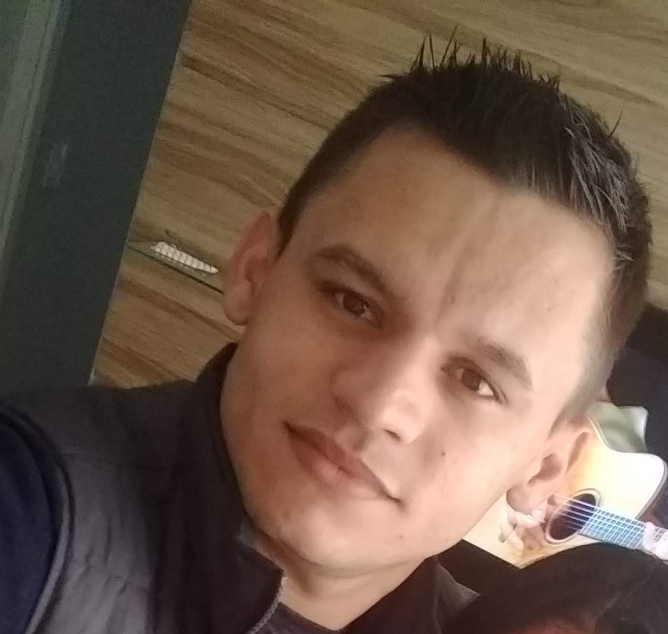

<!DOCTYPE html>
<html lang="pt-br">
    <head>
        <meta charset="utf-8">
        <link type="text/css" rel="stylesheet" href="estilo.css">
        <title>CV - Luciano Gomes</title> 
    </head>
     <body> 
        
        <h1>Luciano Gomes de Assis</h1>
        

        
Brasileiro, 28 anos, Casado 
        <a href="https://www.linkedin.com/in/luciano-gomes-b301106a//">luciano.g5@hotmail.com</a> 
        (11) 98708-3569 | (11) 0000-0000 
        Estrada Itaquera Guaianazes, 2001
        
 
        
 
        <h2>Objetivos Profissionais</h2>
        
Analista de Sistemas   Supervisor de T.I

        

        <h2>Resumo Profissional</h2>  
        
Formado na área de Tecnologia da informação/ADS.
            Experiência de 2 anos na software house "O2 Tecnologia" e atualmente estou há 5 anos na "Tel Telecomunicações",   em
            ambas atuando com o suporte de sistemas, testes de software/release, e atualmente exercendo a função de "Líder Técnico
            de suporte".  
            Sou um profissional que gosta de desafios, proativo e admirador do trabalho em equipe.   
            As principais atividades do meu cargo atual são: Apoio ao time (Esclarecendo dúvidas, monitorando as atividades e dando
            feedbacks), participação em novos projetos,   levantamentos de requisitos junto aos usuários, e treinamento do sistema
            sempre que necessário. Participação nas reuniões quinzenais com o time de POs, Desenvolvimento  e Scrum Master, para entrega e criação do
            novo sprint.   
            Métodos ágeis.
        

        <h2>Formação</h2>
        

            <strong>Escolaridade:</strong>   Formação superior completa   
            <strong>Graduação:</strong>   Analise e Desenvolvimento de Sistemas, Unicid (Junho de 2019) - Concluído   
            <strong>Ensino Médio Profissionalizante:</strong>   Técnico de Informática, Senac (Junho de 2013) - Concluído  
        

        <h2>Histórico Profissional</h2>
        
 <b>Tel Telecomunicações:</b> 
                    (Analista de Suporte / Lider Técnico desde Outubro/2014)  
                    Suporte via telefone, e-mails e atendimento de chamados, treinamento referente as mudanças e novas funcionalidades do sistema. Apoio ao time, esclarecendo dúvidas e auxiliando   
                    nas conclusões das atividades. Participação na implantação de novos projetos, testes de softwares, 
                    levantamento das necessidades do usuário.   
            <strong>O2 Tecnologia em Sistema LTDA:</strong> 
                    (Analista de Suporte Help Desk. - Junho/2012 a Agosto/2014)  
                    Suporte aos usuários do sistema, suporte de rede interno e externo. Instalação/Configuração/Manutenção de micros, impressoras, softwares e sistemas operacionais.
                    Treinamentos aos  usuários do sistema (Via Fone e acesso remoto).        
        

        <h2>Último Salário e Benefícios</h2>
        

            <strong>Último salário:</strong>  R$ 0.000,00   </li></ol> 
            <strong>Benefícios:</strong>  Assistência Medica, Vale Alimentação, Seguro de Vida, Vale transporte e PPR. </li></ol>
        

        <h2>Outros Objetivos</h2>
        

            <strong>Pretensão salarial:</strong>  Faixa de R$ 0.000,00   </li> 
            <strong>Região de interesse:</strong>  Preferência pela região de São Paulo/SP.   
            <strong>Aceita viajar pela empresa:</strong>  Sim.
        

        <h2>Informações complementaress</h2></h2>
        
Buscando novas oportunidades no mercado de trabalho.
 
        <strong><a href="Fotos/Foto1.jpg" target="_blank">Perfil</a></strong> &nbsp <!--&nbsp; é para dar um espaço-->
        <strong><a href="Fotos/Foto2.jpg" target="_blank">Companheira</a></strong>
        
    </body> 
</html>

